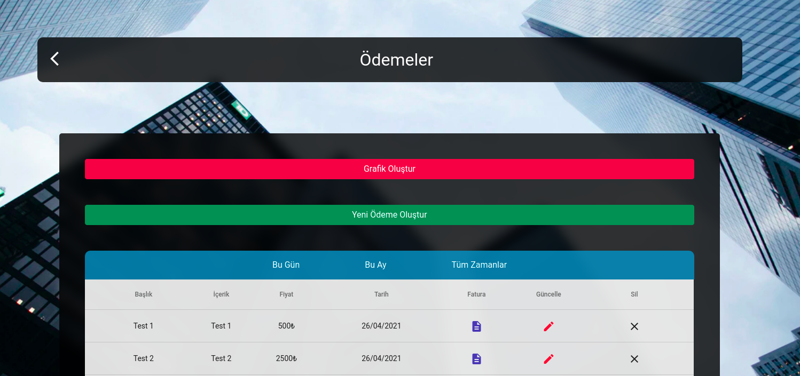
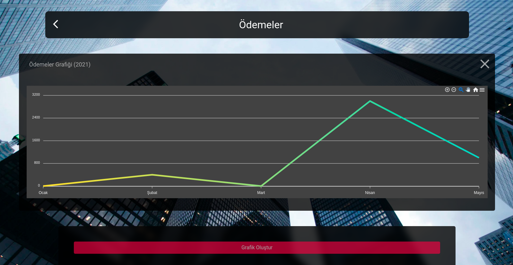
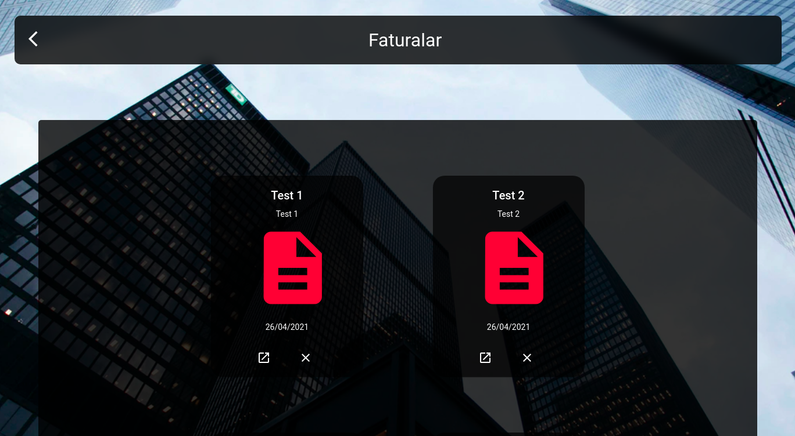
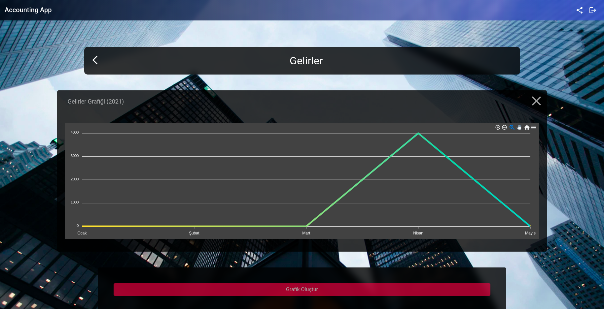

# Accounting App
### *Project Information*:
 #####
 - _Frontend:_ Angular Framework 
 #####
 - _Backend:_ NestJS 
 #####
 - _Database:_ PostgreSQL 
 #####
- _Language:_ Turkish
 #####
- _In Project Photos:_ Unsplash
 
  
  

### *Project Features*:
 - Save and List Expenses and Incomes
   #####
      - _Daily View Expenses and Incomes_,
    - _Monthly View Expenses and Incomes_,
    - _All Time View Expenses and Incomes_
   #####
  - Graphical View of Annual Expenses and Income
   #####
 - PDF View for Invoices

  
  

### Some Images from the Application

 

 

 

 

